# Jaguary

**Permission before payment for autonomous agents.**

[](https://github.com/yuribodo/jaguary/actions/workflows/ci.yml)

[Open the live demo](https://jaguary.vercel.app) · [Read the Decision Log](docs/decision-log.md) · [Copy the Hackathon Decision Export](docs/hackathon-decision-log.md) · [Explore the technical documentation](docs/technical/README.md) · [Review known gaps](docs/technical/known-gaps.md)

Jaguary is a reference application for governed agentic commerce. Its core enforcement layer, **Bound**, decides whether an identified agent may perform one exact economic action before a payment credential is resolved or money can move.

The current product demonstrates a flight-purchase journey: TravelBot interprets a request, searches Google Flights through SerpApi, receives merchant-authored terms from VuelaYa, asks the human to approve a scoped mandate, and submits the exact checkout to deterministic verification.

> **New to the project?** Start with the [Jaguary Decision Log](docs/decision-log.md) to see how the product evolved, which assumptions changed, and why the current authority model exists.

> **OpenAI proposes. The merchant fixes the terms. AP2 carries authority. Bound decides. Payment waits for `ALLOW`.**

[Open the system diagram](docs/diagrams/system-context.html) · [Explore the database map](docs/diagrams/database-domain-map.html)

## Why Jaguary exists

An LLM can understand intent and navigate choices, but it should not be the final authority over money. Jaguary separates probabilistic agent behavior from deterministic economic control.

Every supported purchase follows the same authority rail:

```text
HUMAN → MANDATE → AGENT → CHECKOUT → BOUND VERIFY → PAYMENT → RECEIPT
```

[](docs/diagrams/readme-authority-rail.html)

_Blue is the authorized economic path; the dashed route is a blocked attempt to bypass Bound. Open the image for the self-contained HTML source._

- The human defines revocable limits, scope, validity, merchant, and payment reference.
- The agent can propose tools only when the persisted workflow state allows them.
- The merchant authors price, items, fulfillment, total, and checkout expiry.
- Bound verifies signatures, bindings, trust, scope, limits, nonce, replay, and current state.
- Only a transactionally reserved `ALLOW` can reach the payment boundary.
- The ledger correlates the decision, payment result, order, and receipt.

## Example journey

Suppose a traveler asks for a flight from São Paulo to Córdoba within a fixed budget:

1. **TravelBot** uses OpenAI to turn the conversation into strict intent and propose only tools allowed by the current workflow state.
2. **Flight Search** queries SerpApi's Google Flights engine, validates the response, and normalizes itineraries into stable internal offers.
3. **VuelaYa** converts the selected offer into merchant-authored, signed UCP-style checkout terms. The model never authors price or total.
4. **The human** reviews those terms and approves an immutable, revocable mandate aligned with the AP2 authorization model.
5. **Bound Verify** checks identity, signatures, checkout binding, scope, limits, nonce, replay, and state before transactionally reserving `ALLOW`.
6. **Payment** runs only from that reservation; the outcome, receipt, and correlated evidence are written to the ledger.
7. **A later dispute** replays the persisted authority, agent, checkout, payment, receipt, and hash-chain evidence to assign liability and record a mock chargeback outcome.

The integration guides explain each boundary and its failure behavior: [OpenAI](docs/technical/openai-travelbot.md), [Google Flights](docs/technical/google-flights-search.md), [Didit](docs/technical/didit-trust.md), [UCP](docs/technical/ucp-commerce.md), and [AP2 / Bound](docs/technical/ap2-bound.md).

## What is implemented

| Area | Current implementation |
| --- | --- |
| Product surface | Next.js application for conversation, trust, approval, mandate, receipt, and audit evidence |
| Agent runtime | OpenAI Agents SDK over the Responses API with strict structured output and state-guarded tools |
| Flight discovery | SerpApi `google_flights` adapter with typed validation, normalization, deduplication, and short-lived caching |
| Merchant | VuelaYa demo merchant with deterministic offers, signed checkout terms, and order receipts |
| Trust | Local assurance plus optional Didit operator verification, biometric consent, and Agent Passports |
| Authority | Scoped, immutable, revocable mandates and an AP2-aligned normalized authorization model |
| Enforcement | Pure ordered policy, signed agent requests, nonce protection, idempotency, and transactional reservation |
| Payments | Durable payment state machine with a deterministic fake executor in the application runtime |
| Evidence | PostgreSQL-backed conversations, decisions, payment attempts, receipts, and correlated hash-chain audit events |
| Disputes | Owner-authenticated unrecognized-purchase flow with deterministic evidence adjudication, liability, mock chargeback outcome, and auditable resolution |

## Current boundaries

This repository is deliberately honest about the difference between a working reference implementation and production interoperability:

- UCP and AP2 are implemented as normalized demo subsets; the public wire contracts are not yet fully conformant with the upstream specifications.
- The Yuno executor exists and is tested in isolation, but the application entry point still installs the fake executor and has no complete webhook/reconciliation path.
- Chargeback recording is deliberately simulated: dispute adjudication is complete and auditable, but no issuer, acquirer, card-network, or Yuno dispute API is called.
- Merchant checkout state and several signing keys remain process-local, so restart and multi-instance operation require durable key and checkout storage.
- Multi-passenger Google Flights searches currently derive a unit quote from `adults=1` and multiply it during checkout.

The complete prioritized audit is in [Known implementation gaps](docs/technical/known-gaps.md).

## Architecture

Jaguary is a pnpm workspace with two deployables and one transactional source of truth:

```text
frontend/   Next.js 16 · React 19 · Tailwind CSS 4
backend/    Fastify 5 · TypeScript · Zod · Drizzle ORM
PostgreSQL  identity · trust · mandates · authorization · payments · ledger
```

The backend is a modular monolith. Keeping identity, mandate state, Verify, replay protection, payment transitions, and audit writes close to one PostgreSQL transaction boundary is intentional.

External systems remain behind narrow adapters:

```text
OpenAI      language understanding and constrained tool proposals
SerpApi     Google Flights discovery
Didit       customer identity and biometric consent evidence
VuelaYa     merchant-authored commerce terms
Yuno        target payment provider; not yet wired into the runtime
```

See [System architecture](docs/technical/architecture.md) for the request path, trust boundaries, failure behavior, and code map.

## Run locally

### Requirements

- Node.js `>=20.9`
- pnpm `>=10`
- Docker with Docker Compose

### Start the application

```bash
pnpm install
cp backend/.env.example backend/.env
pnpm db:up
pnpm db:migrate
pnpm dev
```

Open:

- Product: [http://localhost:3000](http://localhost:3000)
- API: [http://localhost:3001](http://localhost:3001)
- Health check: [http://localhost:3001/health](http://localhost:3001/health)

The checked-in example configuration uses development authentication, local trust, PostgreSQL on port `55432`, and fake payment execution. OpenAI and live flight search fail closed until their backend-only variables are configured.

To exercise the full conversational flight path, configure the OpenAI/TravelBot and SerpApi variables listed in [`backend/.env.example`](backend/.env.example), and register the matching public TravelBot identity and logical payment credential. Didit and Langfuse are optional. Provider secrets must remain in the backend environment and must never use a `NEXT_PUBLIC_` prefix.

For detailed database, provider, Postman, and integration-test instructions, use the [backend guide](backend/README.md).

## Development commands

| Command | Purpose |
| --- | --- |
| `pnpm dev` | Run frontend and backend together |
| `pnpm dev:frontend` | Run only the Next.js application |
| `pnpm dev:backend` | Run only the Fastify API |
| `pnpm db:up` | Start the development PostgreSQL container |
| `pnpm db:migrate` | Apply backend migrations |
| `pnpm db:test:up` | Start the isolated test database |
| `pnpm test:integration` | Run PostgreSQL integration tests |
| `pnpm check` | Run lint, typecheck, tests, and production builds |

## Repository map

```text
.
├── frontend/              product surface and browser API client
├── backend/               API, domain modules, migrations, and tests
├── docs/technical/        current code-backed technical guides
├── docs/decision-log.md   chronological decisions, discoveries, and corrections
├── docs/diagrams/         editable architecture and sequence diagrams
├── docs/adr/              accepted architecture decisions
├── docs/design/           product and visual-system rationale
├── docs/spikes/           bounded investigations, not committed behavior
├── compose.yaml           isolated development and test PostgreSQL
└── package.json           workspace commands and quality gate
```

## Documentation

| Topic | Guide |
| --- | --- |
| Start here | [Documentation home](docs/README.md) |
| Project evolution and rationale | [Jaguary Decision Log](docs/decision-log.md) |
| Architecture and boundaries | [Technical documentation](docs/technical/README.md) |
| PostgreSQL tables and relationships | [Database model and diagrams](docs/technical/database-model.md) |
| OpenAI and TravelBot | [Integration guide](docs/technical/openai-travelbot.md) |
| Google Flights through SerpApi | [Integration guide](docs/technical/google-flights-search.md) |
| Didit and agent trust | [Integration guide](docs/technical/didit-trust.md) |
| UCP commerce | [Integration guide](docs/technical/ucp-commerce.md) |
| AP2 and Bound Verify | [Integration guide](docs/technical/ap2-bound.md) |
| Architecture decisions | [ADR index](docs/README.md#architecture-decision-records) |
| Deployment | [Vercel and Neon guide](docs/deployment.md) |
| Missing production work | [Known implementation gaps](docs/technical/known-gaps.md) |

## Engineering principles

1. No model or browser response can directly create `ALLOW` or execute payment.
2. Economic values come from persisted merchant checkout and reserved authorization state.
3. Active authority is immutable, scoped, time-bound, revocable, and replay-protected.
4. External evidence is normalized before policy evaluation; Verify performs no OpenAI or Didit network call.
5. Provider calls happen outside database transactions and converge through stable idempotency keys.
6. Raw credentials, PAN, CVV, provider secrets, and sensitive payloads do not enter public contracts or logs.

## Contributing and support

Contributions should stay small enough to review and preserve the authority boundary. Before opening a pull request:

1. Start from an existing issue, or open one to align on user-visible features and protocol changes.
2. Add or update tests for authorization, money movement, identity, and external-contract behavior.
3. Run `pnpm check` and document any check that could not run locally.
4. Update the relevant technical guide; record decisions with durable consequences as an ADR.

Use [GitHub Issues](https://github.com/yuribodo/jaguary/issues) for reproducible bugs, implementation gaps, and scoped proposals. Documentation changes should follow [Documentation conventions](docs/technical/documentation-conventions.md); the current backlog starts in [Known implementation gaps](docs/technical/known-gaps.md).
