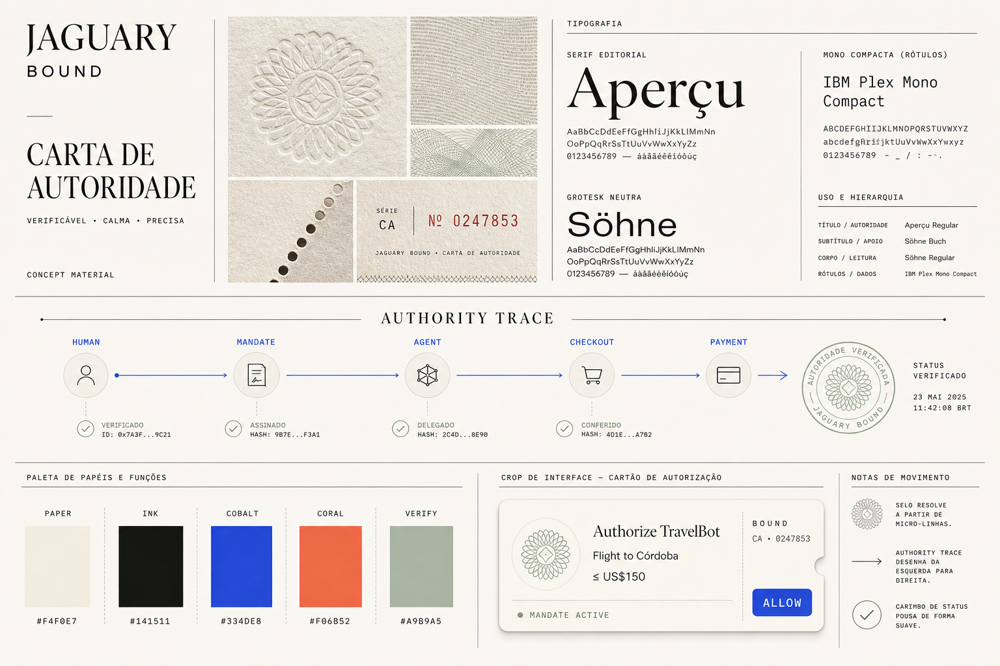
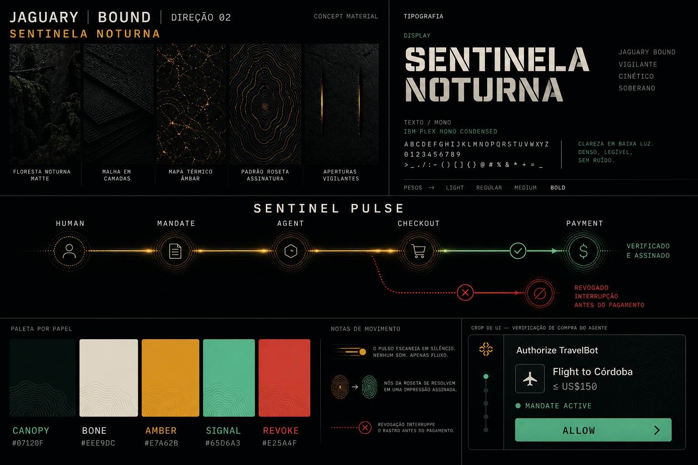
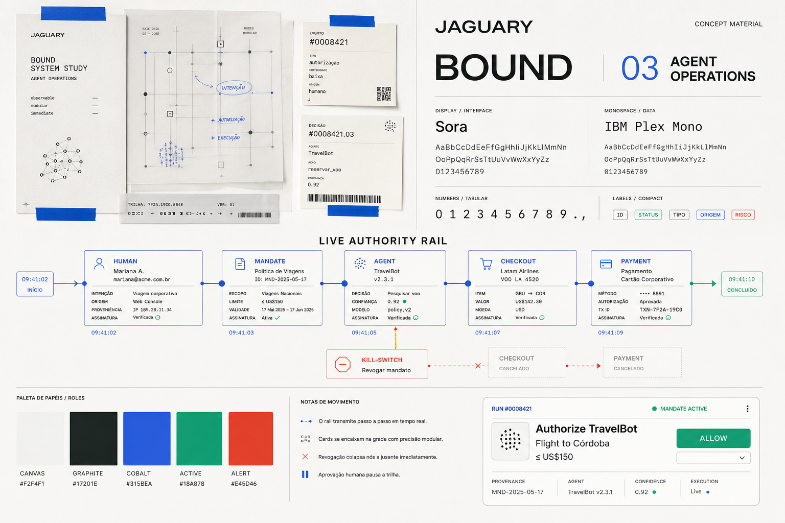

# Jaguary / Bound — visual discovery

Status: **alignment gate**. These directions are concept material. Do not turn one into production UI until the team chooses or combines a direction.

## Design brief

Jaguary is the team and brand world. Bound is the product: the enforcement layer that decides whether an autonomous agent may perform a specific economic action before a payment credential is resolved or money moves.

The first frontend is a desktop-first hackathon demo for three overlapping audiences:

1. Marta, who delegates a purchase and needs understandable control.
2. A judge, who needs to see the product thesis in seconds.
3. A developer or operator, who needs inspectable evidence of what happened.

The interface must make four moments unmistakable:

- the human defines and authorizes a mandate;
- the agent searches, evaluates and requests a purchase;
- Bound verifies identity, authority, scope, state and replay safety;
- Yuno is called only after `ALLOW`, while revocation stops the flow before payment.

### Intended qualities

- **Verifiable:** evidence is visible, not hidden behind a success toast.
- **Vigilant:** the system feels continuously aware without becoming threatening.
- **Immediate:** live agent activity and human control read at a glance.

### Anti-qualities

- **Cyberpunk:** no neon-purple “AI future”, glowing brains or excessive glass.
- **Generic fintech:** no interchangeable blue gradients, card stacks or padlock heroes.
- **Cute chatbot:** the agent is an accountable actor, not a mascot in a chat bubble.

## Reference evidence

These references are evidence for specific product or visual decisions, not templates to reproduce.

| Reference | Evidence we borrow | What we avoid copying |
| --- | --- | --- |
| [Yuno Agentic Commerce](https://www.y.uno/en/product/agentic-commerce) | Large editorial type, generous whitespace and a clear platform message | Yuno blue, its dashboard chrome and its page composition |
| [Crossmint Agentic Cards](https://www.crossmint.com/products/agentic-cards) | Permission limits and revocable access explained as tangible payment objects | Card-wall hero, green brand language and literal network-card presentation |
| [Browserbase](https://www.browserbase.com/) | Agent activity as something live, observable and replayable | Orange brand, pixel mountain aesthetic and event campaign language |
| [Trulioo Agentic Trust Infrastructure](https://www.trulioo.com/solutions/agentic) | Identity presented with editorial authority rather than security clichés | Trulioo palette, head illustration and serif treatment as-is |
| [Visa Trusted Agent Protocol](https://developer.visa.com/use-cases/trusted-agent-protocol) | Signed identity, context binding and replay protection as explicit checkpoints | Visa blue, network branding and protocol-specific UI conventions |
| [Google guide to UCP + AP2](https://developers.googleblog.com/developers-guide-to-ai-agent-protocols/) | A legible chain from intent to mandate, checkout and receipt | Diagram styling and protocol branding |
| [Stripe Agentic Commerce](https://docs.stripe.com/agentic-commerce) | Scoped, time-limited payment credentials and precise technical language | Stripe gradient, docs chrome and component styling |
| [Central Bank of Brazil — banknote security](https://www.bcb.gov.br/detalhenoticia/739/noticia) | Watermark, hidden number, relief and the jaguar on the R$50 note as a Brazilian metaphor for verifiability | Reproducing a banknote, official symbols or currency artwork |
| [ICMBio — jaguar conservation](https://www.gov.br/icmbio/pt-br/assuntos/biodiversidade/pan/pan-onca-pintada/1-ciclo/pan-onca-pintada-sumario.pdf) | Nocturnal vigilance and rosettes as a unique visual fingerprint | Literal wildlife imagery or a jaguar mascot |

## Shared product content

All three boards use the same purchase so the team compares visual systems, not different stories:

```text
Authorize TravelBot
Flight to Córdoba
≤ US$150
MANDATE ACTIVE
ALLOW
```

The common interaction primitive is an **authority trace**:

```text
HUMAN → MANDATE → AGENT → CHECKOUT → PAYMENT
```

It is the candidate signature element for Jaguary/Bound. Its form changes by direction, but its meaning does not.

## Direction 01 — Authority Letter



**Thesis:** cryptographic authorization should feel as understandable and durable as a signed passport or security document, while remaining contemporary and digital.

- Mood: calm, premium and highly trustworthy.
- Signature element: `AUTHORITY TRACE`, joined to a cryptographic seal made from an abstract jaguar rosette.
- Material world: warm paper, blind embossing, microprint, serials and perforations.
- Typography: editorial serif + neutral sans + compact mono. Production candidates: Instrument Serif, Geist and IBM Plex Mono.
- Palette: paper `#F4F0E7`, ink `#141511`, cobalt `#334DE8`, coral `#F06B52`, verify `#A9B9A5`.
- Motion: the seal resolves from micro-lines; the trace draws left to right; verified stamps land softly.

**Best at:** mandate creation, receipts, audit evidence and explaining why a purchase was authorized.

**Risk:** on its own, it can underplay the sense that an agent is actively working.

## Direction 02 — Night Sentinel



**Thesis:** Bound is the quiet sentinel between autonomous action and money movement.

- Mood: nocturnal, vigilant and cinematic without becoming cyberpunk.
- Signature element: `SENTINEL PULSE`; an amber pulse turns green only after verification, while revocation breaks the rail before payment.
- Material world: matte canopy, layered mesh, thermal flecks and rosette fingerprints.
- Typography: strong contemporary grotesk + condensed mono. Production candidates: Archivo, Geist and IBM Plex Mono.
- Palette: canopy `#07120F`, bone `#EEE9DC`, amber `#E7A62B`, signal `#65D6A3`, revoke `#E25A4F`.
- Motion: a silent scan moves through each checkpoint; rosette nodes resolve into a signature; revoke interrupts downstream motion immediately.

**Best at:** the live demo, verification theater and the high-impact `REVOKE → PAYMENT BLOCKED` moment.

**Risk:** using it everywhere could fatigue users and reduce legibility in information-heavy screens.

## Direction 03 — Agent Operations



**Thesis:** make autonomous behavior understandable as a calm operations room where every intent, decision and payment is inspectable and interruptible.

- Mood: precise, modular and product-forward.
- Signature element: `LIVE AUTHORITY RAIL`, enriched with time, provenance, confidence and signature state.
- Material world: drafting paper, annotation tape, trace overlays, event cards and machine-readable marks.
- Typography: technical neutral sans + tabular mono. Production candidates: Sora or Geist + IBM Plex Mono.
- Palette: canvas `#F2F4F1`, graphite `#17201E`, cobalt `#315BEA`, active `#18A878`, alert `#E45D46`.
- Motion: events stream step by step; cards snap to the rail; approval pauses it; revocation collapses downstream nodes.

**Best at:** the agent run view, logs, adversarial scenarios and a product operators can use daily.

**Risk:** without a distinctive brand layer, it can drift toward a familiar developer SaaS dashboard.

## Recommended synthesis

Use **Authority Letter as the base system** and **Night Sentinel as the live execution mode**:

- warm, legible surfaces for Marta's mandate, passport, payment method and receipt;
- a dark focused stage when TravelBot is acting and Bound is verifying;
- the operational density of Agent Operations inside expandable evidence and developer views;
- one authority trace across every mode, preserving the product's mental model.

This gives Jaguary a recognizable visual world without forcing every screen into the same atmosphere. The brand is not “a jaguar-themed app”; it is a system whose marks behave like unique rosettes and whose posture is quietly vigilant.

## Proposed application surfaces

Once the direction is approved, the frontend should be designed in this order:

1. **Mandate composer:** human intent, policy constraints, payment source and authorization.
2. **Agent run:** discovery/browser activity, candidates, reasoning summary and current checkpoint.
3. **Bound Verify:** authority trace, evidence checklist, `ALLOW`, `DENY` or `HITL`.
4. **Mandate detail:** state, usage, expiry, payment method reference and `REVOKE`.
5. **Receipt and audit:** UCP checkout, AP2 proof, Bound decision, Yuno result and immutable timestamps.
6. **Agent passport:** operator, build fingerprint, public key, supported protocols and status.

## Alignment gate

Before implementation, decide:

1. Which direction leads: `01`, `02`, `03`, or the recommended `01 + 02` synthesis?
2. Should users primarily see **Jaguary**, **Bound by Jaguary**, or just **Bound**?
3. Should the default experience feel **calm/editorial** or **live/operational**?

## Generation record

The boards are original concept material generated for this repository. They intentionally use the same 3:2 composition, content and comparison structure.

<details>
<summary>Final image prompt — Direction 01</summary>

```text
Create an original high-end visual design moodboard, landscape 3:2, for a Brazilian agentic commerce trust product. Brand name JAGUARY, product name BOUND. Direction 01 titled “AUTHORITY LETTER”. This is concept material, not a finished webpage. Cryptographic authorization should feel as legible and trustworthy as a signed passport or security document, but contemporary and digital. Use a disciplined editorial grid with warm paper, embossing, microprinting, guilloche, serials, an abstract jaguar-rosette fingerprint, serif/sans/mono typography, a HUMAN → MANDATE → AGENT → CHECKOUT → PAYMENT authority trace, role-based palette and one restrained authorization UI crop. Avoid generic fintech, sci-fi, cyberpunk, glassmorphism, literal jaguars and padlock clichés.
```

</details>

<details>
<summary>Final image prompt — Direction 02</summary>

```text
Create an original high-end visual design moodboard, landscape 3:2, for JAGUARY / BOUND. Direction 02 titled “NIGHT SENTINEL”. This is concept material, not a finished webpage. Bound is the quiet sentinel between an autonomous agent and money movement. Use matte midnight forest surfaces, abstract rosette fingerprints, narrow watchful apertures, bold grotesk plus mono typography, and a SENTINEL PULSE through HUMAN → MANDATE → AGENT → CHECKOUT → PAYMENT. Amber becomes green only after verification and a red revoke branch interrupts payment. Include a role-based palette and one restrained verification UI crop. Avoid cyberpunk, purple AI gradients, glassmorphism, literal jaguars, dystopian surveillance and padlock clichés.
```

</details>

<details>
<summary>Final image prompt — Direction 03</summary>

```text
Create an original high-end visual design moodboard, landscape 3:2, for JAGUARY / BOUND. Direction 03 titled “AGENT OPERATIONS”. This is concept material, not a finished webpage. Make autonomous activity understandable like a calm live operations room. Use drafting paper, annotation tape, event index cards, tracing overlays, sparse rosette node clusters, precise sans plus mono typography, and a LIVE AUTHORITY RAIL through HUMAN → MANDATE → AGENT → CHECKOUT → PAYMENT with timestamps, provenance, confidence, signatures and a kill switch. Include a role-based palette and one modular agent-run UI crop. Avoid generic dashboards, terminal overload, purple AI gradients, chat-bubble UI and robot illustrations.
```

</details>
